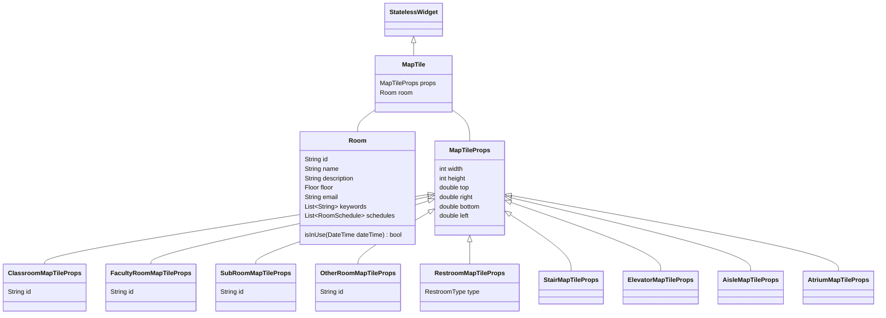

# Map

## MapTile

```mermaid
classDiagram
  StatelessWidget <|-- MapTile
  MapTile -- Room
  MapTile -- MapTileProps
  MapTileProps <|-- ClassroomMapTileProps
  MapTileProps <|-- FacultyRoomMapTileProps
  MapTileProps <|-- SubRoomMapTileProps
  MapTileProps <|-- OtherRoomMapTileProps
  MapTileProps <|-- RestroomMapTileProps
  MapTileProps <|-- StairMapTileProps
  MapTileProps <|-- ElevatorMapTileProps
  MapTileProps <|-- AisleMapTileProps
  MapTileProps <|-- AtriumMapTileProps

  class StatelessWidget

  class MapTile {
    MapTileProps props
    Room room
  }

  class Room {
    String id
    String name
    String description
    Floor floor
    String email
    List~String~ keywords
    List~RoomSchedule~ schedules
    isInUse(DateTime dateTime) bool
  }

  class MapTileProps {
    int width
    int height
    double top
    double right
    double bottom
    double left
  }

  class ClassroomMapTileProps {
    String id
  }

  class FacultyRoomMapTileProps {
    String id
  }

  class SubRoomMapTileProps {
    String id
  }

  class OtherRoomMapTileProps {
    String id
  }

  class RestroomMapTileProps {
    RestroomType type
  }

  class StairMapTileProps {
  }

  class ElevatorMapTileProps {
  }

  class AisleMapTileProps {
  }

  class AtriumMapTileProps {
  }
```
